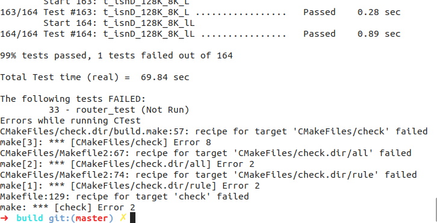

Lab 6 Writeup
=============

My name: [<font color="purple">刘轩昂</font>]

My Student number : [<font color="purple">201220198</font>]

This lab took me about [<font color="purple">5</font>] hours to do.

#### 1. Program Structure and Design:

本次实验要求实现`Network_Interface`，ARP协议； <br>

#### 2. Implementation:

为了方便实现，引入一些辅助变量和函数：
``` cpp
// ARP条目 
    struct ARP_Entry {
        EthernetAddress eth_addr;
        size_t ttl;
    };
// network_interface.hh
    // ARP表
    std::map<uint32_t, ARP_Entry> _arp_table{};
    // 存放已经发送的ARP报文。如果发送了ARP请求后，在过期时间（5s）内没有返回响应，则丢弃等待的IP报文
    std::map<uint32_t, size_t> _waiting_arp_response_ip_addr{};
     // 存放等待ARP报文返回的IP报文
    std::list<std::pair<Address, InternetDatagram>> _waiting_arp_internet_datagrams{};
```
具体源码比较冗长，在此省略。

#### 3. Tests:


**make check**：



### Problems faced:

1. `ARP_entry.ttl` = 30s，到期后需要移除；
2. 如果ARP request在5s内无响应则重新发送；
3. 可能是由于长时间待机，`make check`时报错资源被占用；
4. `tap.sh`、`tun.sh`、`txrx.sh`文件可能损坏，从lab7复制后解决。